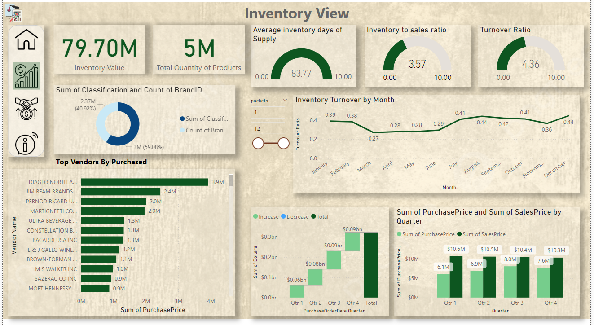

# Inventory-Shop-Analysis-YouTube

An Interactive Inventory Analysis Power BI Dashboard provides dynamic insights into inventory management, enabling businesses to make data-driven decisions. Here's what it offers:

Key Features:1 2 34
Real-Time Stock Monitoring:

Track inventory levels for each product in real time.
Visual alerts for low stock or overstocked items.
Category and Product Analysis:

Drill-down features to analyze performance by product category or individual items.
Identify fast-moving and slow-moving products.
Monthly and Seasonal Trends:

Interactive charts to explore monthly inventory purchases and sales trends.
Seasonal demand forecasts for better stocking decisions.
Inventory Value Analysis:

Breakdown of inventory value by product, category, or supplier.
Insights into high-value stock for cost optimization.
Supplier Performance Insights:

Assess delivery timelines and order accuracy for each supplier.
Compare supplier reliability to streamline procurement processes.
Customizable Filters:

Apply filters by date range, product type, or region to focus on specific insights.
Export filtered data for detailed reporting.
User Interactivity:
Hover Insights: Hover over charts and graphs to view detailed tooltips with contextual data.
Click-to-Explore: Click on visual elements like bars, lines, or pie slices to drill into related data.
Dynamic Segmentation: Use slicers to adjust views based on categories, timelines, or inventory status.
This dashboard empowers wine shop owners to maintain optimal stock, minimize wastage, and enhance profitability while providing an engaging and user-friendly experience.
